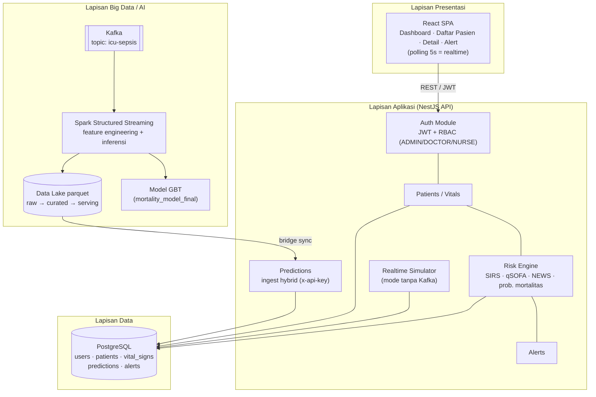
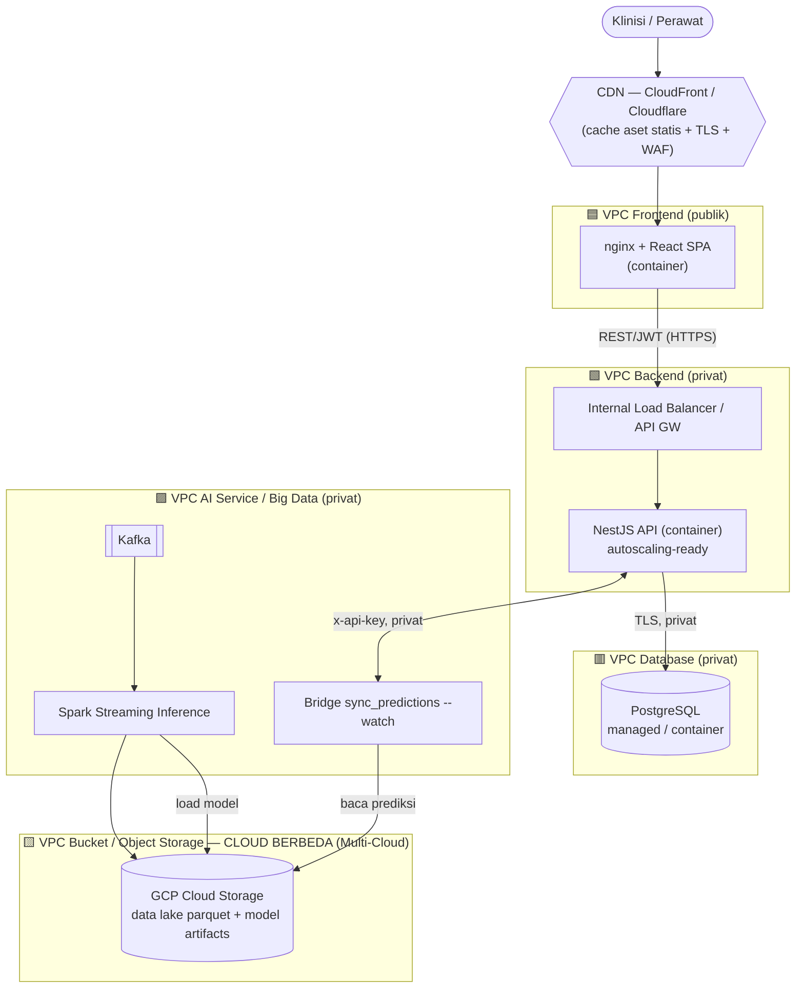
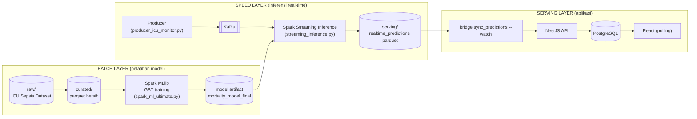
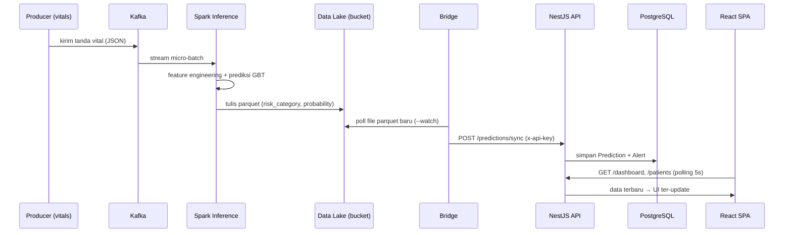
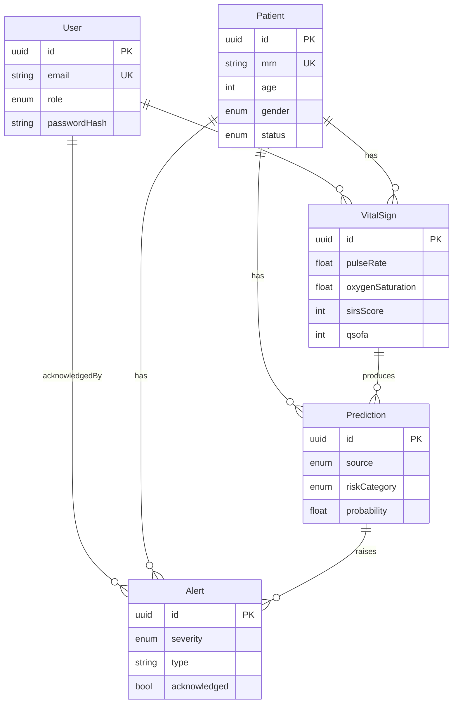
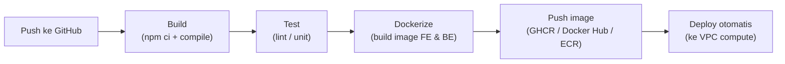

# Arsitektur Sistem — ICU Patient Monitoring (Cloud Computing EAS)

> **Mata Kuliah:** Cloud Computing (IFB302) — Institut Teknologi Nasional
> **SDG yang didukung:** **SDG 3 — Good Health and Well-being (Kesehatan & Kesejahteraan)**
> **Domain:** Monitoring pasien ICU secara real-time + prediksi risiko mortalitas berbasis AI/ML.

Dokumen ini menjelaskan **tujuan proyek** dan **arsitektur sistem** yang dirancang
agar memenuhi seluruh ketentuan tugas Cloud Native (8 komponen wajib, segmentasi
VPC, multi-cloud, containerization, dan CI/CD).

---

## 1. Latar Belakang & Tujuan Proyek

### 1.1 Masalah (SDG 3 — Kesehatan)
Di ruang ICU, kondisi pasien dapat memburuk dalam hitungan menit. Pemantauan manual
tanda vital (nadi, pernapasan, tekanan darah, saturasi oksigen) dan penilaian risiko
oleh perawat bersifat periodik dan rawan terlambat. Keterlambatan mengenali tanda
**sepsis / perburukan** berkorelasi langsung dengan peningkatan mortalitas.

### 1.2 Tujuan
Membangun **sistem pemantauan pasien ICU berbasis cloud** yang:
1. Menampilkan kondisi pasien **secara real-time** (tanda vital terus berubah).
2. Menghitung **skor risiko klinis** otomatis (SIRS, qSOFA, NEWS, Shock Index).
3. Menjalankan **model AI/ML** untuk memprediksi probabilitas mortalitas dan
   mengklasifikasikan risiko (Rendah / Sedang / **Tinggi/gawat**).
4. Memunculkan **peringatan (alert)** otomatis saat risiko meningkat.
5. Berjalan di atas **arsitektur cloud-native** yang aman, terkontainerisasi,
   tersegmentasi (VPC), multi-cloud, dan ter-otomasi melalui CI/CD.

### 1.3 Manfaat
Deteksi dini perburukan → intervensi lebih cepat → menurunkan angka kematian ICU,
mendukung target **SDG 3.4** (mengurangi kematian dini akibat penyakit).

---

## 2. Ringkasan Solusi

Sistem terdiri dari **dua bidang (plane)** yang terintegrasi secara **hybrid**:

| Bidang | Peran | Komponen |
| --- | --- | --- |
| **Application plane** | Aplikasi monitoring untuk klinisi (CRUD, dashboard, alert) | React SPA · NestJS API · PostgreSQL |
| **Big Data / AI plane** | Pemrosesan streaming + model ML prediksi mortalitas | Kafka · Spark Structured Streaming · Model GBT · Data Lake (parquet) |

Kedua bidang dihubungkan oleh **bridge** ([`pipelines/bridge/sync_predictions.py`](../pipelines/bridge/sync_predictions.py))
yang menyinkronkan hasil prediksi ML (parquet) ke API melalui endpoint
`POST /api/predictions/sync` (diamankan API key).

---

## 3. Pemetaan Komponen Wajib Cloud

| # | Komponen Wajib | Implementasi pada Proyek | Lokasi |
| --- | --- | --- | --- |
| 1 | **Frontend** | React 18 + TypeScript (Vite), disajikan via nginx | [`apps/frontend`](../apps/frontend) |
| 2 | **Backend / API** | NestJS 11 + TypeScript (REST, JWT, RBAC) | [`apps/backend`](../apps/backend) |
| 3 | **Database** | PostgreSQL 16 (ORM Prisma, migrasi + seed) | [`apps/backend/prisma`](../apps/backend/prisma) |
| 4 | **Object Storage / Bucket** | Data Lake parquet + artefak model ML (raw/curated/serving) → bucket cloud sekunder | [`data/`](../data) → GCP Cloud Storage |
| 5 | **Docker Container** | Multi-stage Dockerfile tiap service + Docker Compose | [`infra/compose`](../infra/compose) |
| 6 | **CDN** | Distribusi aset statis SPA (cache di edge) | CloudFront / Cloudflare |
| 7 | **VPC** | Segmentasi 5 VPC (Frontend/Backend/DB/Storage/AI) | lihat §5 |
| 8 | **AI Service / AI Engine** | Spark MLlib (GBT) prediksi mortalitas + streaming inference | [`pipelines/ml`](../pipelines/ml), [`pipelines/streaming/spark`](../pipelines/streaming/spark) |

---

## 4. Arsitektur Logis (Application Layers)

**Penjelasan singkat alur aplikasi:**
- Frontend memanggil API melalui REST + token JWT; halaman utama melakukan
  **polling tiap 5 detik** sehingga data tampak berubah real-time.
- Setiap perekaman tanda vital memicu **Risk Engine** menghitung skor klinis,
  menyimpan `Prediction`, dan menaikkan `Alert` bila risiko meningkat.
- **Realtime Simulator** (built-in) menggerakkan data tanpa perlu Kafka untuk demo;
  bila pipeline Big Data aktif, simulator dimatikan dan data berasal dari Spark.

---

## 5. Arsitektur Cloud & Segmentasi VPC

Setiap komponen ditempatkan pada **VPC terpisah** sesuai ketentuan, dengan
konektivitas privat antar-VPC (VPC peering / private link). Hanya Frontend (via CDN)
yang terekspos publik; Backend, Database, dan AI berada di subnet privat.

### 5.1 Tabel Segmentasi VPC

| VPC | Isi | Eksposur | Keamanan |
| --- | --- | --- | --- |
| **Frontend VPC** | nginx + SPA | Publik (lewat CDN) | Hanya 80/443; di belakang CDN/WAF |
| **Backend VPC** | NestJS API | Privat (akses via LB/API GW) | Security group hanya izinkan dari FE & CDN |
| **Database VPC** | PostgreSQL | Privat penuh | Hanya menerima koneksi dari Backend VPC |
| **Storage VPC (Bucket)** | Object storage parquet/model | Privat + signed URL | IAM least-privilege, enkripsi at-rest |
| **AI Service VPC** | Kafka + Spark + bridge | Privat | Hanya komunikasi internal + ke bucket |

### 5.2 Multi-Cloud
Sesuai ketentuan, **Object Storage memakai cloud yang berbeda** dari compute utama:

| Lapisan | Cloud Provider |
| --- | --- |
| Compute (Frontend, Backend, DB, AI) | **AWS** (mis. EC2/ECS, RDS) — *cloud utama* |
| Object Storage (Data Lake parquet + model) | **GCP Cloud Storage** — *cloud sekunder* |

> Alternatif yang valid: Compute di Azure + Bucket di AWS S3. Untuk pengembangan
> lokal, bucket dapat disimulasikan dengan **MinIO** (S3-compatible).

---

## 6. Arsitektur Data & AI (Lambda Architecture)

Sistem mengikuti pola **Lambda Architecture** (batch + speed layer) dengan
**Data Lake berlapis (medallion)**: `raw → curated → serving`.

### 6.1 Alur Data Real-time (sequence)

### 6.2 Dua Mode Operasi
| Mode | Sumber data realtime | Kapan dipakai |
| --- | --- | --- |
| **A — Simulator bawaan** | NestJS `SimulatorService` (random-walk klinis tiap 8s) | Demo cepat tanpa Kafka/Spark |
| **B — Pipeline Spark/Kafka** | Producer → Kafka → Spark → parquet → bridge | Arsitektur Big Data penuh |

---

## 7. Integrasi AI

AI terintegrasi **langsung ke sistem** (memenuhi ketentuan wajib min. 1 fitur AI):

1. **Model Machine Learning (utama)** — *Gradient Boosted Trees* (Spark MLlib) yang
   dilatih pada ICU Sepsis Dataset untuk memprediksi **probabilitas mortalitas**.
   Pada *speed layer*, model di-load oleh Spark Structured Streaming untuk inferensi
   real-time dan menghasilkan `risk_category` + `probability`.
   - Feature engineering: MAP, Shock Index, SIRS, qSOFA, rasio CRP/WBC, dll.
   - Lihat [`pipelines/ml/spark_ml_ultimate.py`](../pipelines/ml/spark_ml_ultimate.py)
     dan [`pipelines/streaming/spark/streaming_inference.py`](../pipelines/streaming/spark/streaming_inference.py).

2. **Clinical Rule Engine (pendukung)** — perhitungan skor klinis tervalidasi
   (SIRS, qSOFA, NEWS, Shock Index) + estimasi logistik di backend, sebagai
   *fallback* dan validasi silang terhadap model ML.
   Lihat [`apps/backend/src/risk/risk.engine.ts`](../apps/backend/src/risk/risk.engine.ts).

> **Opsional (nilai tambah):** integrasi **Claude API / LLM** untuk membuat ringkasan
> naratif kondisi pasien ("clinical summary") dari tanda vital + skor — dapat
> ditambahkan sebagai AI Service terpisah di AI VPC.

---

## 8. Desain Database

- Relasi ber-FK dengan `onDelete` cascade/set-null; indeks pada kolom yang sering
  difilter (`status`, `patientId+recordedAt`, `acknowledged+createdAt`).
- Skema lengkap: [`apps/backend/prisma/schema.prisma`](../apps/backend/prisma/schema.prisma).
- Skrip SQL inisialisasi tersedia melalui migrasi Prisma
  ([`apps/backend/prisma/migrations`](../apps/backend/prisma/migrations)).

---

## 9. Keamanan

| Aspek | Mekanisme |
| --- | --- |
| Autentikasi | JWT (Bearer), password di-hash bcrypt |
| Otorisasi | RBAC per-route (`@Roles` ADMIN/DOCTOR/NURSE) |
| Ingest mesin-ke-mesin | API key (`x-api-key`) untuk endpoint `/predictions/sync` |
| Validasi input | `class-validator` + `ValidationPipe` (whitelist) |
| Isolasi jaringan | Segmentasi VPC; DB & AI tidak terekspos publik |
| Transport | HTTPS/TLS di CDN & antar-VPC |
| Secrets | Variabel environment (`.env`) — **tidak** masuk Git (lihat `.gitignore`); di cloud pakai Secrets Manager |
| Edge | CDN + WAF (rate-limit, proteksi DDoS dasar) |

---

## 10. Containerization & Deployment

- **Docker (wajib):** setiap service punya `Dockerfile` multi-stage.
  - Backend: build → runtime Node, jalankan `prisma migrate deploy` saat boot.
  - Frontend: build Vite → disajikan nginx (sekaligus reverse-proxy `/api`).
- **Docker Compose (wajib):** orkestrasi lokal Postgres + Backend + Frontend +
  service `seeder` ([`infra/compose/docker-compose.yml`](../infra/compose/docker-compose.yml)).
- **Roadmap nilai tambah:** Kubernetes (Deployment/Service/Ingress per VPC),
  Helm chart, dan Terraform (Infrastructure as Code) untuk provisioning VPC + bucket.

---

## 11. CI/CD Pipeline

Pipeline target memenuhi minimal: **Build → Test → Dockerize → Push image → Deploy**.

- Saat ini: workflow build + test untuk frontend & backend
  ([`.github/workflows/ci.yml`](../.github/workflows/ci.yml)).
- Tahap berikut: tambah job *build-push image* ke registry dan *deploy* otomatis
  (mis. `docker compose pull && up -d` via SSH, ECS service update, atau `kubectl apply`).

---

## 12. Skalabilitas & Monitoring

- **Skalabilitas:** Backend stateless (token JWT) → horizontal scaling di belakang
  load balancer; Kafka mem-buffer lonjakan data; Spark memproses paralel; PostgreSQL
  dapat memakai read-replica. (*Autoscaling* = kandidat nilai bonus.)
- **Monitoring:** endpoint `/api/health`; *roadmap* Prometheus (metrik) + Grafana
  (dashboard) sebagai nilai bonus. Logging terpusat untuk audit alert klinis.

---

## 13. Pemetaan ke Rubrik Penilaian

| Aspek (bobot) | Dipenuhi oleh |
| --- | --- |
| Cloud Architecture (20%) | §5 segmentasi 5 VPC, CDN, security |
| Integrasi AI (20%) | §7 model GBT + rule engine (relevan SDG 3) |
| Multi-Cloud (10%) | §5.2 compute AWS + bucket GCP |
| Frontend & Backend (10%) | React SPA + NestJS REST (JWT) |
| Database Design (5%) | §8 ERD, relasi, indeks |
| Docker & Containerization (10%) | §10 Dockerfile + Compose |
| CI/CD (10%) | §11 pipeline build→test→dockerize→push→deploy |
| Dokumentasi (5%) | dokumen ini + [`apps/README.md`](../apps/README.md) |
| **Bonus** | K8s, Terraform (IaC), Prometheus/Grafana, autoscaling |

---

## 14. Status Implementasi (Lokal vs Target Cloud)

| Bagian | Lokal (sekarang) | Target Cloud |
| --- | --- | --- |
| Frontend/Backend/DB | ✅ jalan via Docker Compose | Deploy per-VPC + CDN |
| AI/ML pipeline | ✅ Kafka + Spark + model (skrip ada) | AI VPC + bucket multi-cloud |
| Realtime UI | ✅ polling + simulator | sama (atau pipeline penuh) |
| CI | ✅ build + test (GitHub Actions) | + dockerize/push/deploy |
| VPC / Multi-Cloud / CDN | 🔜 desain (dokumen ini) | provisioning (Terraform) |

---

## 15. Kesimpulan

Sistem ICU Patient Monitoring memadukan **aplikasi cloud-native** (React + NestJS +
PostgreSQL) dengan **pipeline Big Data/AI** (Kafka + Spark + model ML) dalam
arsitektur **hybrid**, **multi-cloud**, dan **tersegmentasi VPC** yang aman serta
ter-otomasi via CI/CD. Solusi ini secara langsung mendukung **SDG 3 (Kesehatan)**
dengan mempercepat deteksi perburukan pasien ICU melalui prediksi risiko real-time.
